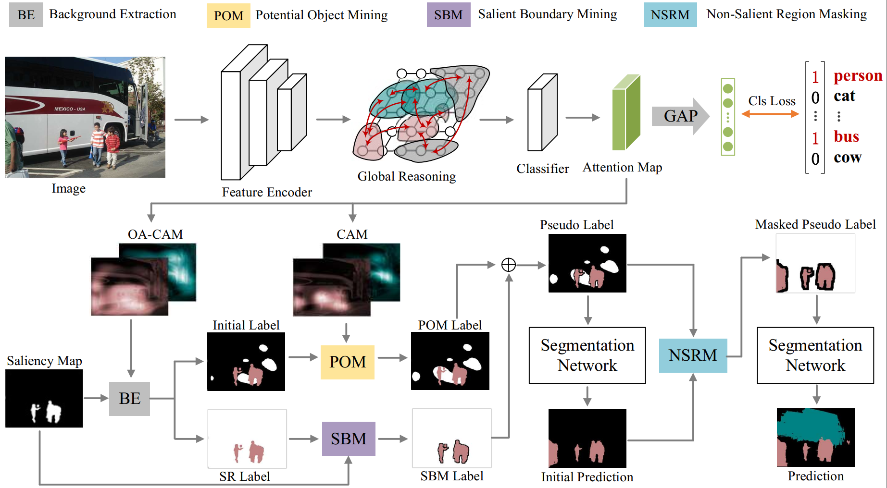

# Non-Salient Object and Salient Boundary Mining for Weakly Supervised Semantic Segmentation


Introduction
------------
This is the source code for our paper **Non-Salient Object and Salient Boundary Mining for Weakly Supervised Semantic Segmentation**.


Network Architecture
--------------------
The architecture of our proposed approach is as follows



## Installation

* Install PyTorch 1.3 with Python 3 and CUDA 10.0

* Clone this repo
```
git clone https://github.com/NUST-Machine-Intelligence-Laboratory/NSOSB.git
```

### Download PASCAL VOC 2012 

* Download [PASCAL VOC 2012](http://host.robots.ox.ac.uk/pascal/VOC/voc2012/#devkit)

## Testing
* Download our trained model [checkpoint_71.3.pth](https://nsrom-2.oss-cn-shanghai.aliyuncs.com/checkpoint_71.3.pth) and put it in the `segmentation/data/models` folder

```
cd segmentation

python main.py test --config-path configs/voc12.yaml --model-path data/models/checkpoint_71.3.pth

python main.py crf --config-path configs/voc12.yaml
```

## Training

```
cd classification
```
* Train the classification model and obtain CAM 
```
./train.sh 
./test.sh 
```

* Train the integral model and obtain the improved OA-CAM 
```
./train_iam.sh
./test_iam.sh
```

* Download the pre-computed [saliency map](https://nsrom-2.oss-cn-shanghai.aliyuncs.com/saliency_aug.tar.gz) and generate the pseudo labels 
```
python gen_label.py
```

* Download the [COCO pre-trained parameters](https://nsrom-2.oss-cn-shanghai.aliyuncs.com/deeplabv1_resnet101-coco.pth)  and put it in the `segmentation/data/models` folder. Then train the segmentation model with pseudo labels . (You need to set the path for pseudo labels.)
```
cd segmentation
python main.py train --config-path configs/voc12.yaml
```
* Get the initial prediction for trainaug images. (You need to go to configs/voc12.yaml and set DATASET.SPLIT.VAL = train_aug. Set it back to val when testing)
```
python trainaug_pred.py test --config-path configs/voc12.yaml \
    --model-path data/models/voc12/deeplabv2_resnet101_msc/train_aug/checkpoint_final.pth

python trainaug_pred.py crf --config-path configs/voc12.yaml -j 10
```
* Generate the masked pseudo labels 
```
cd classification
python gen_masked_label.py
```
* Train the segmentation model with the masked pseudo labels. (You need to set the path for masked pseudo labels.)
```
cd segmentation
python main.py train --config-path configs/voc12.yaml
```


## Acknowledgements
This codebase is heavily borrowed from [OAA-PyTorch](https://github.com/PengtaoJiang/OAA-PyTorch) and [deeplab-pytorch](https://github.com/kazuto1011/deeplab-pytorch).

